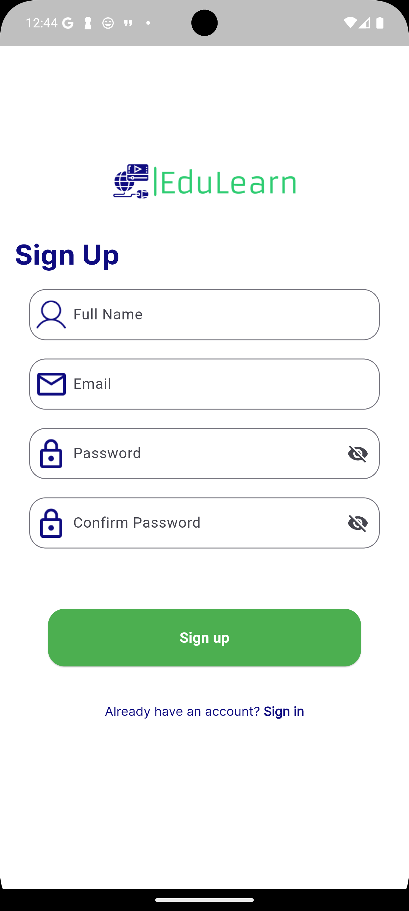
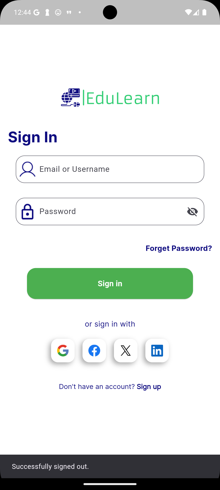
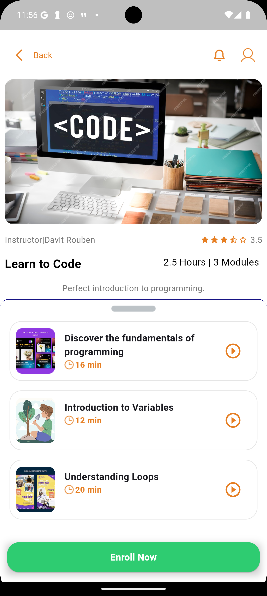

# Flutter Course Enrolling Application

This is a **Flutter-based Course Enrolling Application** that allows users to browse courses, enroll in them, and track their progress.

---

## Key Features

- **State Management**: Implemented using **Riverpod** for clean and efficient state management.
- **User Authentication**: Firebase Authentication enables secure user login and registration.
- **Local Service Model**: Populates the app with initial course content.
- **Course Enrollment**: Users can enroll in courses, which are added to the `my_courses` subcollection of their Firestore `users` document.
- **Progress Tracking**: Tracks progress for each enrolled course.

---

## Screenshots

### Splash screen


### Sign up


### Sign in


### Home Screen


### Course Details


### My Courses


---

## Setup Instructions

1. Clone the repository:  
   ```bash
   git clone https://github.com/Zaptek-Flutter/EduLearn
   ```
2. Install dependencies:  
   ```bash
   flutter pub get
   ```
3. Configure Firebase for your project (update `google-services.json`).
4. Run the app:  
   ```bash
   flutter run
   ```

---

